# 🧬 BioBridge AI

> **An AI-powered biotechnology learning assistant built with Google Gemini API.**

BioBridge AI is an open-source educational project designed to help biotechnology students learn biological concepts through AI-assisted explanations, quizzes, mnemonics, and doubt solving.

Version 1 (V1) was developed as the capstone project for the **Google × Kaggle AI Agents Intensive Course**, while serving as the foundation for a much larger long-term vision. The project is intended to grow throughout my B.Tech journey into a comprehensive biotechnology + AI platform for students, researchers, and lifelong learners.

---

## 📖 Project Overview

Learning biotechnology often requires switching between textbooks, online resources, and search engines to understand concepts, revise terminology, and practice questions.

BioBridge AI brings these tasks into a single AI-powered assistant.

Users can:

- Explain biotechnology concepts
- Ask biology-related doubts
- Generate memory-friendly mnemonics
- Practice AI-generated quizzes

The project focuses on making biotechnology learning more interactive, structured, and accessible.

---

## 🎓 Google × Kaggle AI Agents Intensive Capstone

BioBridge AI is an independent, self-initiated project conceived as a long-term, multi-year open-source effort. Version 1—the version in this repository—was developed and submitted as the capstone project for the **Google × Kaggle AI Agents Intensive Course**.

Each feature applies a specific AI engineering concept learned during the program:

| Feature | AI Engineering Concept |
|----------|------------------------|
| 🧠 Mnemonic Generator | Basic Gemini API integration |
| 📘 Concept Explainer | Human-in-the-loop interaction design |
| 📝 Quiz Generator | Structured AI output using a fixed JSON schema |
| ❓ Doubt Solver | AI safety through deterministic pre-LLM validation |
| 📜 Application-wide Logging | Monitoring AI behavior and diagnostics |

Instead of building a one-time demo, I designed BioBridge AI as a long-term open-source project that will continue evolving throughout my undergraduate studies. Future versions will expand into research assistance, bioinformatics workflows, literature exploration, and AI-powered scientific tools.

---

## ✨ Features

### 🧠 Concept Explainer

Provides structured explanations of biotechnology and biology concepts using Google Gemini, with a **confirm-before-generate** step so users can review their input before the AI response is generated.

Each explanation includes:

- Definition
- Why it Matters
- How it Works
- Key Terms
- Easy Analogy
- Key Takeaways

---

### ❓ Doubt Solver

Allows users to ask biology or biotechnology-related questions.

Responses are designed to be:

- Beginner-friendly
- Accurate
- Easy to understand
- Educational rather than overly technical

---

### 📝 Quiz Generator

Generates a five-question multiple-choice quiz on any biotechnology topic.

Features include:

- 5 AI-generated MCQs
- Four options per question
- Instant scoring
- Correct answers with explanations
- Structured JSON generation
- Session-based quiz workflow

---

### 💡 Mnemonic Generator

Creates memorable mnemonics that help users retain biological terminology and concepts more effectively.

---

## 🏗️ Architecture

BioBridge AI follows a simple, modular architecture. Each part of the app has one clear job, and everything connects through a small number of shared components.

```
                User
                 │
                 ▼
        app.py (Streamlit UI)
                 │
   routes input to the selected feature
                 │
                 ▼
      Feature module (src/*.py)
   concept_explainer / doubt_solver /
   quiz_generator / mnemonic_generator
                 │
        ┌────────┴────────┐
        │                  │
 Doubt Solver only:   All features:
 validate_input()     build prompt →
 (rule-based check    call Gemini API
  before any API call)     │
        │                  │
        └────────┬─────────┘
                  ▼
          src/logger.py → log_event()
                  │
                  ▼
        logs/biobridge_log.jsonl
```

**How it works, end to end:**

1. `app.py` is the only entry point. It shows the feature selector and routes the user's input to the matching module in `src/`.
2. Each feature module is self-contained — it builds its own prompt, calls the Gemini API (`gemini-2.5-flash`) directly, and handles its own errors with try/except.
3. The Doubt Solver is the only feature with an extra step before the Gemini call: `validate_input()` checks the question against four rule-based categories (harmful, medical, homework, off-topic) and can reject it without ever calling the API.
4. Every feature call — whether it succeeds, fails, or gets rejected — is recorded through one shared `log_event()` function in `src/logger.py`, which writes a fixed seven-field entry to `logs/biobridge_log.jsonl`.
5. Shared values (feature names, status strings, rejection reasons) live in `src/constants.py` so they're never hardcoded more than once across the four feature files.

This structure means any single feature — including its prompt, its logic, and its logging — can be read, tested, or changed without touching the other three.

---

## 🛡️ Safety Validation

BioBridge AI performs deterministic rule-based validation **before** sending prompts to the language model.

The application rejects requests involving:

- Harmful content
- Medical advice
- Homework completion
- Off-topic queries

This validation ensures unsupported requests are filtered before any AI response is generated, keeping the model focused on biotechnology education.

---

## 📜 Logging

BioBridge AI includes lightweight structured logging for monitoring application behavior.

Each interaction records:

- Timestamp
- Feature used
- Request status
- User input (truncated)
- Response latency
- Error information (if applicable)
- Rejection reason (when applicable)

Logs are stored locally in **JSONL** format.

---

## 🛠️ Tech Stack

- Python
- Streamlit
- Google Gemini API
- Google AI Studio
- python-dotenv
- JSON Lines (JSONL) Logging

---

## 📂 Project Structure

```text
BioBridge-AI/
│
├── app.py
├── requirements.txt
├── README.md
├── LICENSE
├── .gitignore
│
└── src/
    ├── concept_explainer.py
    ├── constants.py
    ├── doubt_solver.py
    ├── logger.py
    ├── mnemonic_generator.py
    └── quiz_generator.py
```

> **Note:** A `logs/` folder containing `biobridge_log.jsonl` is created automatically at runtime and is excluded from version control via `.gitignore`.

---

## 🚀 Installation

### 1. Clone the repository

```bash
git clone https://github.com/kokilavani-rk/BioBridge-AI.git
cd BioBridge-AI
```

### 2. Create a virtual environment

```bash
python -m venv .venv
```

Activate it.

**Windows**

```bash
.venv\Scripts\activate
```

**macOS / Linux**

```bash
source .venv/bin/activate
```

### 3. Install dependencies

```bash
pip install -r requirements.txt
```

### 4. Configure environment variables

Create a `.env` file in the project root.

```env
GEMINI_API_KEY=your_api_key_here
```

---

## ▶️ Run the Application

```bash
streamlit run app.py
```

The application will open in your default web browser.

---

## 💡 Example Use Cases

- 📚 Learn biotechnology concepts
- 🧪 Revise before exams
- 📝 Practice MCQs
- 💡 Generate revision mnemonics
- ❓ Clarify difficult biology topics

---

## 📸 Screenshots

### Home
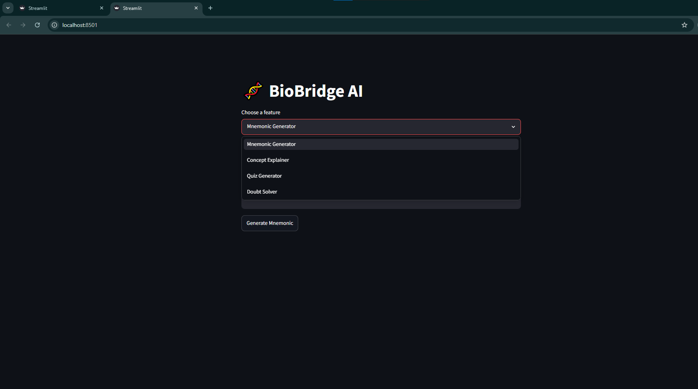

### Mnemonic Generator
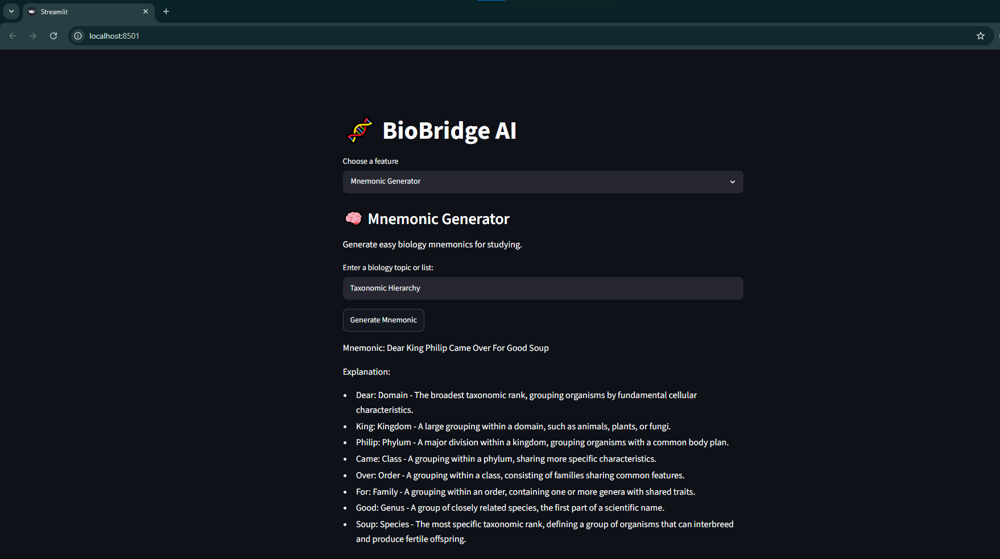

### Concept Explainer
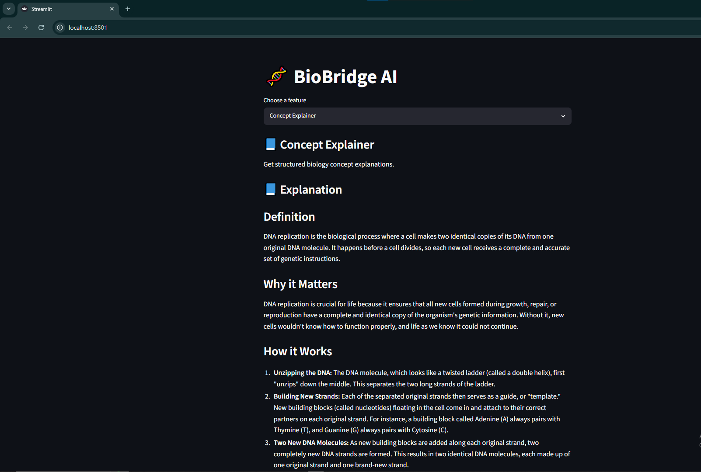
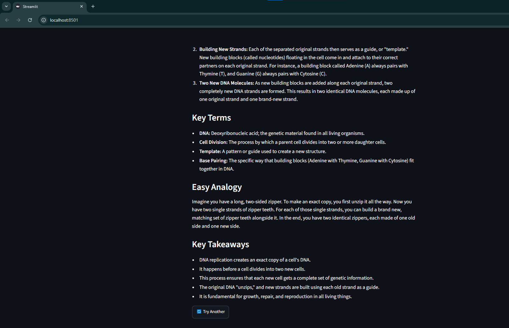

### Quiz Generator
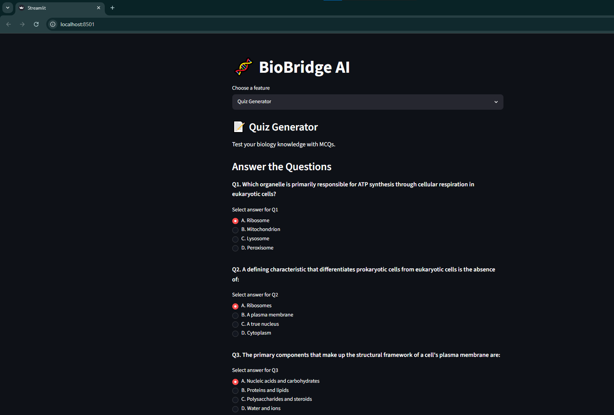
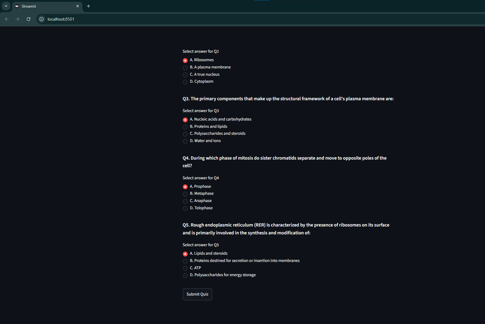

### Quiz Results
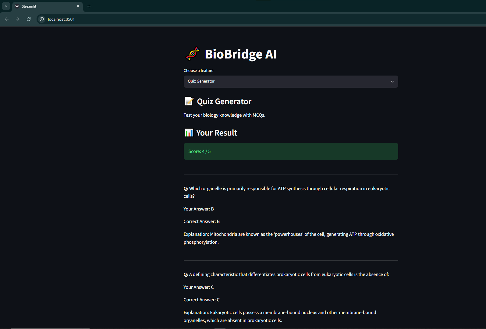
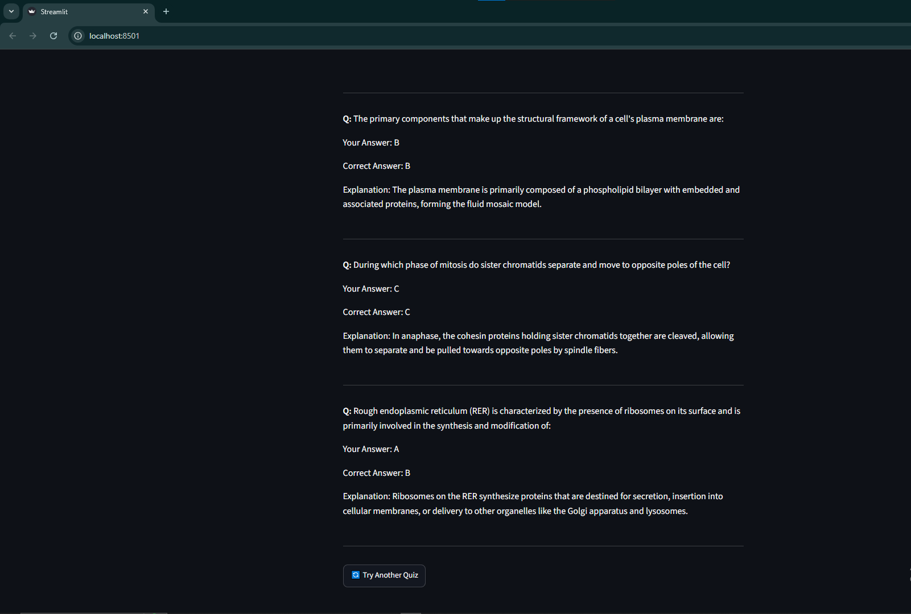

### Doubt Solver
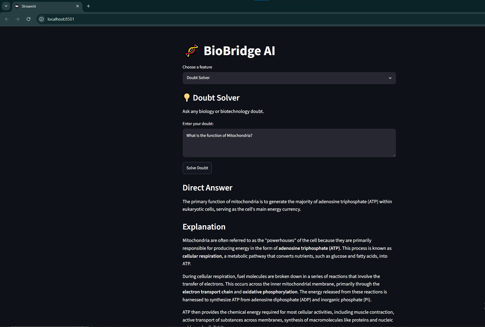
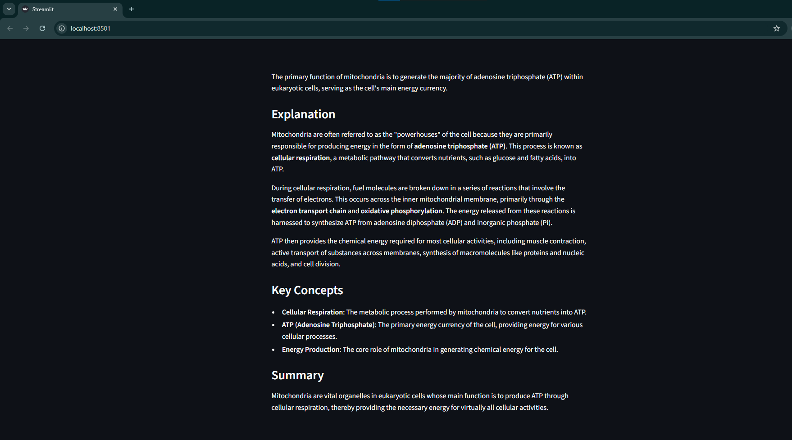

### Safety Validation Example
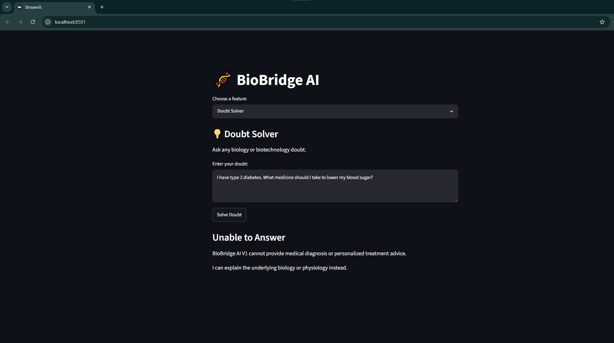

### JSONL Logging
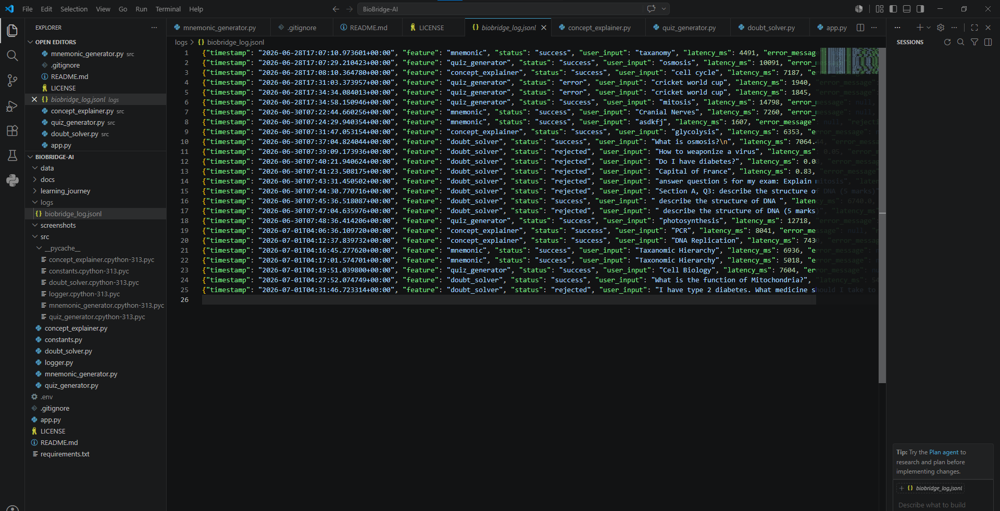

---

## 🎯 Project Goals

BioBridge AI aims to:

- Make biotechnology learning more interactive.
- Improve conceptual understanding.
- Encourage active learning through quizzes.
- Help students revise efficiently using mnemonics.
- Demonstrate responsible AI application in biotechnology education.

---

## 🔮 Future Roadmap

BioBridge AI is planned as a multi-version project evolving throughout my B.Tech journey.

### 🚀 Version 2

- Improved UI/UX
- Chat-style interaction
- Accessibility features
  - Text-to-Speech (TTS)
  - Speech-to-Text (STT)
  - Dyslexia-friendly fonts
  - Simple-language mode
- Learning history
- Lab report generator
- Viva question preparation

---

### 🔬 Version 3

- Research paper summarization
- Scientific literature assistant
- Gene and protein explanation
- Personalized learning support

---

### 🧬 Version 4

- Bioinformatics assistant
- PubMed integration
- NCBI integration
- UniProt integration
- Scientific database exploration via MCP

---

### 🤖 Version 5

- AI-powered research companion
- Drug discovery learning tools
- Clinical concept summaries
- Full open-source release

---

## 🤝 Contributing

Contributions, suggestions, and feedback are welcome.

If you would like to improve BioBridge AI, feel free to:

- Fork the repository
- Open an issue
- Submit a pull request

---

## 📄 License

This project is licensed under the **[MIT License](LICENSE)**.

---

## 🙏 Acknowledgements

- Google AI Studio
- Google Gemini API
- Google × Kaggle AI Agents Intensive Course
- Streamlit
- Open-source Python Community

---

## 👤 Author

**Kokilavani R**

GitHub: **[@kokilavani-rk](https://github.com/kokilavani-rk)**

BioBridge AI is a long-term open-source initiative focused on combining biotechnology and artificial intelligence to build practical educational and research tools for the life sciences community.